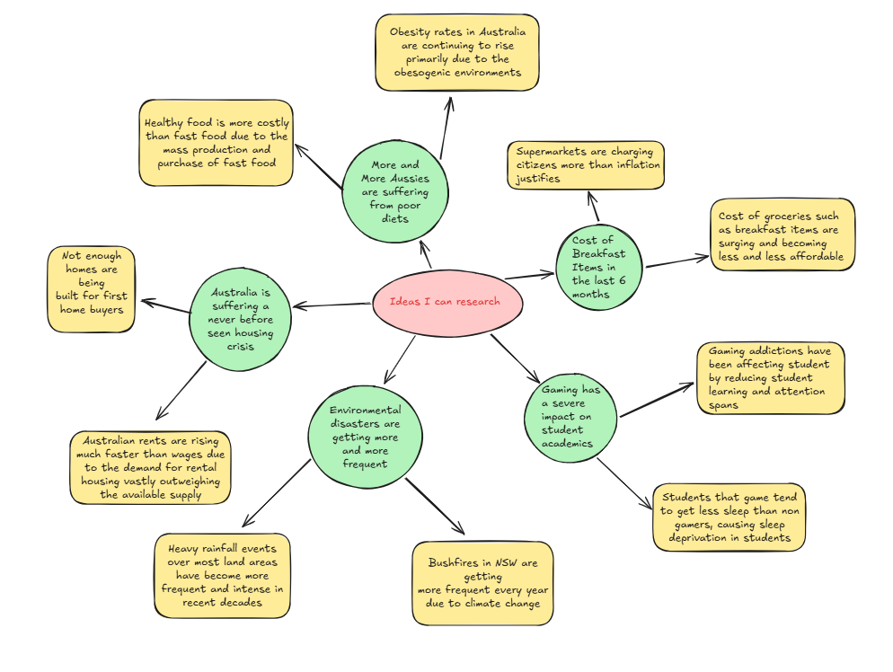

# Phase 1: Identifying and Defining
## Requirements Outline
### Mind Map -

### Functional Requirements
#### Data Loading
- The system must be able to load the CSV file (breakfast.csv) using Pandas
- The system must load the dataset automatically when the program starts without the user needing to do anything

#### Data Cleaning
- The system must allow the user to filter through data by country name
- The system must allow the user to filter through data by individual food item

#### Data Analysis
- The system must be able to calculate the average price of the breakfast basket for each country
- The system must be able to calculate the average price of each individual food item across all months
- The system must display price changes across the 6 month period (October 2025 to March 2026)

#### Data Visualisation
- The system must display a line graph of all item prices for a selected country using Matplotlib
- The system must display a bar graph comparing the average breakfast basket price across all 20 countries using Matplotlib
- The system must display a line graph showing the price of a single food item across all 20 countries using Matplotlib
- All graphs must have a title, x axis label and y axis label

#### Data Reporting
- The system must print the hypothesis to the terminal when requested
- The dataset will remain stored in the original breakfast.csv file

---

## Non-Functional Requirements

### Usability
- The system must provide a clear text-based menu that is easy to navigate
- The system must display a list of valid country names and food items before asking the user to type one
- The system must include a README.md file that explains how to run the program and use each menu option
- Menu options must be numbered and the user should only need to type a single number to navigate

### Reliability
- The system must display a clear error message if the user types a country name that does not exist in the dataset 
- The system must not crash if the user enters an invalid menu option, it should prompt them to try again 
- The system must ensure the data loaded from the CSV matches the original dataset without any modifications

---

## Use Case

**Actor:** User

**Goal:** To access and interact with breakfast food price data through the program's text-based user interface.

**Preconditions:**
- The breakfast.csv dataset has already been loaded into the system via data_module.py
- The user has Python installed and is able to run main.py from the terminal

**Main Flow:**
1. User runs main.py and is presented with the text-based menu
2. User selects one of the following options:
   - a. View hypothesis 
   - b. View full dataset 
   - c. View item prices for a country 
   - d. View all country basket prices 
   - e. Select single food for all countries
3. System performs the action and outputs the result to the user
4. User is returned to the main menu after each action
5. User selects option 6 to exit the program

**Postconditions:**
- User has viewed/interacted with the breakfast price data
- Data remains available for further use later
---
# Phase 2: Researching and Planning

## Research

### Articles and Sources

1. **SBS News (August 2025)**
"Prices don't go back: How did grocery costs see their biggest rise in five years?" [Article 1](https://www.sbs.com.au/news/article/grocery-costs-biggest-rise-five-years-inflation-eases/v8gxqf9zo). This article describes how due to inflation the cost of grocery items is increasing forcing shoppers to change their habits.

2. **Deakin University – Global Centre for Preventive Health and Nutrition (2025)**
"What can Australia do to prevent supermarket price gouging?[Article 2](https://healthyfoodretail.com/what-can-australia-do-to-prevent-supermarket-price-gouging/). "The article argues that recent food price inflation in Australia has been unusually high and may not be explained solely by supply-chain and global economic pressures. It talks about concerns that major supermarkets may have engaged in “greedflation” or excessive pricing by increasing prices beyond what rising costs justified.

## Discuss the findings - SEEC Paragraph
**Statement:**
Based on the following findings, it is clear that not just Australian supermarkets but supermarkets worldwide have been raising prices beyond what inflation alone can justify, placing significant financial pressure on everyday ordinary Australian families.
**Explanation:** According to research from Deakin University's Global Centre for Preventive Health and Nutrition, food and beverage prices averaged around 6.6% inflation between 2021 and 2023. More than double the previous two decades. The rate of increase was even highet at around 10-12% for staple foods such as grains, milk and dairy products. According to SBS News in August 2025 the average weekly grocery bill for a family of four has risen 11% in a single year, from $216 to $240.
**Example:** Deakin University's research also highlighted the concept of "greedflation", where a Canadian study found that local farmers' markets raised prices less than mainstream grocery stores during the same period, even though they faced similar supply costs. This suggests that major supermarket chains are choosing to inflate prices rather than being forced to. SBS News further reported that over 80% of Australians have changed their shopping habits in the past year to try to reduce costs, with more than 61% now visiting two or more supermarkets each week.
**Conclusion:** In conclusion, both sources point grocery prices rising faster than general inflation world wide, with Australian families bearing financial burden. This supports the hypothesis that supermarkets worldwide are taking advantage of inflation to overcharge consumers on necessary goods.

## Points For and Against the Hypothesis

### For: Supermarkets are overcharging
- The Australia Institute found corporate profits significantly contributed to inflation between 2019 and 2022
- Staple food prices rose far above the general CPI (Consumer Price Index) rate with cheese up 27.3%, bread up 24.1%
- The Australian government introduced price gouging legislation specifically targeting Coles and Woolworths
- A Canadian study showed farmers' markets raised prices less than supermarkets despite facing the same costs

### Against: Supermarkets are not deliberately overcharging
- Supermarkets have argued that price increases are driven by higher fuel, storage and supply chain costs
- Under Australian law, businesses are legally allowed to set their own prices — raising prices is not inherently illegal
- Global factors such as covid, climate events and international conflict have driven food production costs worldwide to skyrocket

### Dataset Parameters
- **Number of countries:** 20
- **Number of months:** 6 (October 2025 to March 2026)
- **Total rows:** 120 (20 countries x 6 months)
- **Total columns:** 12
- **Source:** Secondary research dataset
- **Currency:** All prices are recorded in US dollars (USD) for fair comparison

| Field                | Datatype | Format for Display | Description                                                                       | Example       | Validation                                                    |
|----------------------|----------|--------------------|-----------------------------------------------------------------------------------|---------------|---------------------------------------------------------------|
| Country              | string   | XX..XX             | Name of the country where the breakfast item/basket is available                  | United States | Can be any amount of letters but must not be numbers          |
| ISO_Country_Code     | string   | XXX                | Country Code which identifies what country it is                                  | USD           | Must be 3 letters all capitals                                |
| Month                | int64    | YYYY-MM            | Date the breakfast item was available at this price and the date of exchange rate |       2025-10 | Must be in the format of YYYY-MM and no exact date            |
| Breakfast_Basket_USD | float64  | NN.NN              | Price at the time of 1L milk, 500g bread, 12 eggs and 500g ground coffee in USD   |         16.18 | Must be combined price of eggs, milk, ground coffee and bread |
| Milk (1L) USD        | float64  | N.NN               | Price at the time of 1L milk  in USD                                              |          1.68 | Must be a positive number with 2 decimal places               |
| Bread (500g) USD     | float64  | N.NN               | Price at the time of 500g bread in USD                                            |          1.68 | Must be a positive number with 2 decimal places               |
| Eggs (12)  USD       | float64  | N.NN               | Price of 12 eggs at the time in USD                                               |          1.68 | Must be a positive number with 2 decimal places               |
| Bananas (1kg) USD    | float64  | N.NN               | Price of 1kg bananas at the time in USD                                           |          1.68 | Must be a positive number with 2 decimal places               |
| Oranges (1kg) USD    | float64  | N.NN               | Price of 1kg oranges at the time in USD                                           |          1.68 | Must be a positive number with 2 decimal places               |
| Cheese (1kg) USD     | float64  | N.NN               | Price of 1kg cheese at the time in USD                                            |          1.68 | Must be a positive number with 2 decimal places               |
| Tomatoes (1kg) USD   | float64  | N.NN               | Price of 1kg  tomatoes at the time in USD                                         |          1.68 | Must be a positive number with 2 decimal places               |
| Chicken (1kg) USD    | float64  | N.NN               | Price of 1kg chicken at the time in USD                                           |          1.68 | Must be a positive number with 2 decimal places               |
---
# Phase 4: Testing and Evaluating
## Analyse and Conclude
### SEEI Paragraph
**Statement:**The data shows that breakfast basket prices have risen across most countries in the dataset over the 6 month period. This supports the idea that supermarkets worldwide are taking advantage of inflation to overcharge on necessary goods, primarily to cover rising costs for labour, energy, and supply chains. (Hypothesis)
**Explaination:**
The dataset tracks the price of 8 breakfast items across 20 countries from October 2025 to March 2026. Looking at the global average, nearly every country in the dataset saw a rise in their breakfast basket price over the 6 months. Countries like Canada ($19.91), Norway ($16.06) and the United States ($15.30) sit at the top of the price range, while India ($3.05) and Brazil ($6.74) sit at the bottom. The significant gap between the most and least expensive countries suggests that factors beyond just supply chain costs are influencing prices.
**Example:**
For example, Australia's breakfast basket price rose from $12.37 in October 2025 to $12.75 in March 2026, a rise of $0.38 over 6 months. Eggs in Australia rose from $4.83 to $5.04 over the same period. Similarly, the United States saw its basket rise from $15.02 to $15.49. These trends across multiple countries suggest that price increases are not isolated to one region but are a worldwide pattern, consistent with the hypothesis.
**Implication:**
Overall, while rising labour, energy and supply chain costs are real pressures, the consistent price increases across nearly all 20 countries suggest the idea that supermarkets worldwide are passing these costs directly onto consumers rather than absorbing them.

**Limitations:**
While the dataset shows clear increases in breakfast basket prices, the project only analyses a six-month period and does not directly compare supermarket profits or inflation rates in each country. Some other factors such as currency exchange rates and supply shortages could also contribute to rising prices. Overall, I think that further research over a longer period of time (longer than the 6 months) would heavily improve the reliability of the findings.

## Peer Verification

## Project Evaluation
